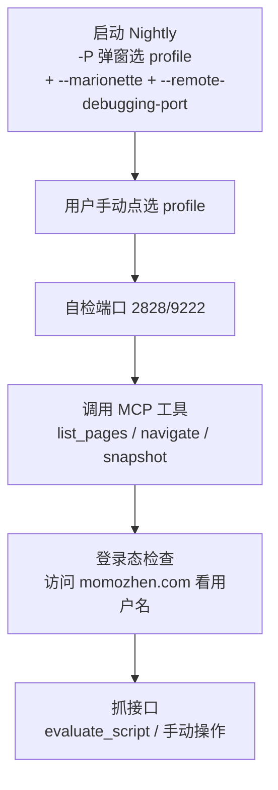

# Firefox Nightly 浏览器调试文档

> 用途：记录用 Firefox Nightly + firefox-devtools-mcp 调试咕咕镇/论坛接口的完整流程与注意事项。
> 最后更新：2026-09-05

---

## 0. 核心规则（必读）

1. **调试脚本默认用 Firefox Nightly，不要用标准版 Firefox。**
   - 标准版（`C:\Program Files\Mozilla Firefox\`）是用户日常浏览器，勿动、勿杀、勿占端口。
   - 所有调试/自动化验证一律启动 Nightly（`C:\Program Files\Firefox Nightly\firefox.exe`）。
2. **MCP 配置文件位置（2026-09-05 更新）**：**profile 级** `%APPDATA%\Code\User\profiles\<profile-id>\mcp.json`（原工作区级 `.vscode/mcp.json` 已删除，改用 profile 级）。
   - 服务器名 `firefox-devtools`（与 ida-pro-mcp 同文件）。
   - ⚠️ **profile 级配置必须带 `--connect-existing --marionette-port 2828 --browser "C:\Program Files\Firefox Nightly\firefox.exe"`**（2026-09-05 血泪）：否则 MCP **不会连已运行的 Nightly**，而是**静默拉起一个全新标准版 Firefox + 临时 profile（rust_mozprofileXXXX，无登录态）**，导致所有页面"未登录"，极难排查。
3. MCP 是 `--connect-existing` 模式：**必须先手动启动 Nightly（带 --marionette），MCP 工具才可用**，否则报 `No Marionette listener on 127.0.0.1:2828`（见 §4.2）。

---

## 1. 环境概览

| 项目 | 值 |
|---|---|
| 浏览器 | Firefox Nightly（`C:\Program Files\Firefox Nightly\firefox.exe`） |
| 标准版 Firefox | `C:\Program Files\Mozilla Firefox\firefox.exe`（**勿误杀**） |
| geckodriver | `%LOCALAPPDATA%\Programs\geckodriver\geckodriver.exe` |
| MCP 服务器 | `@mozilla/firefox-devtools-mcp@latest`（经 npx 运行） |
| MCP 配置位置 | **profile 级** `%APPDATA%\Code\User\profiles\<profile-id>\mcp.json`（2026-09-05 起，原工作区级已删） |
| 调试端口 | **2828**（Marionette）+ **9222**（BiDi/remote-debugging） |
| 登录 cookie 位置 | `%APPDATA%\Mozilla\Firefox\Profiles\30hfbhjk.default-nightly\cookies.sqlite` |

### Profile 一览（%APPDATA%\Mozilla\Firefox\Profiles\）

| Profile 名 | 目录 | cookies 大小 | 归属 |
|---|---|---|---|
| `default-nightly` | `30hfbhjk.default-nightly` | 524KB ✅ | Nightly 专用 |
| `default-release` | `4cx9grih.default-release` | 1MB | 标准版 Firefox |
| `default` | `dt82209w.default` | 0 | 空 profile |

> ⚠️ **咕咕镇 cookie 实测（2026-09-05）**：cookie 有效期约 1 天且会被顶掉，
> 实测发现 momozhen/guguzhen 的 `fyg2019_*` cookie 在 **标准版 `default-release`** 里，
> **Nightly 的 `default-nightly` 反而没有** → 调试前先确认 cookie 在哪个 profile，
> 必要时用 `tools/get_cookies.py --refreshggz` 刷新后再进 Nightly 走入口链登录。

> ⚠️ **Firefox 数据分两地存储**：cookies.sqlite 等会话数据在 **Roaming**（`%APPDATA%`），
> 而 cache 等在 **Local**（`%LOCALAPPDATA%`）。改 profile 时两处同名目录要一起考虑。

---

## 2. MCP 配置（profile 级 mcp.json，2026-09-05 起）

> 位置：`%APPDATA%\Code\User\profiles\<profile-id>\mcp.json`（当前 profile `-367578e4`）
> 原工作区级 `.vscode/mcp.json` 已删除（2026-09-05 提交 610aa6a），避免与 profile 级重复加载。

```json
{
  "servers": {
    "firefox-devtools": {
      "command": "npx",
      "args": [
        "-y",
        "@mozilla/firefox-devtools-mcp@latest",
        "--connect-existing",
        "--marionette-port",
        "2828",
        "--browser",
        "C:\\Program Files\\Firefox Nightly\\firefox.exe",
        "--tool-preset",
        "developer"
      ]
    }
  }
}
```

**关键参数**：
- `--connect-existing`：连接**已运行**的 Firefox 实例（所以必须先手动启动 Nightly，否则 MCP 工具报 `No Marionette listener on 127.0.0.1:2828`）
- `--marionette-port 2828`：指定 Marionette 端口
- `--browser`：**必须显式指定 Nightly 路径**（2026-09-05 血泪）——不加 `--connect-existing` 时 MCP 会默认拉起标准版 Firefox + 临时 profile
- `env.PATH`：必须包含 geckodriver 所在目录，否则找不到驱动

---

## 3. 启动 Firefox Nightly（重要！）

### 3.1 正确启动命令（默认：用户手动选 profile）⭐

**每次启动都必须弹窗让用户手动选 profile**（不写死 profile 参数），避免启动到错误 profile 导致登录态/cookie 对不上：

```powershell
Start-Process "C:\Program Files\Firefox Nightly\firefox.exe" -ArgumentList @("--marionette", "--remote-debugging-port", "9222", "-P")
```

**三个标志缺一不可**：
- `--marionette` → 启用 Marionette 协议（MCP 需要）
- `--remote-debugging-port 9222` → 启用 BiDi WebSocket 端点
- `-P` → 弹出"选择用户配置文件"窗口，**用户手动点选**要用的 profile（如 `default-nightly`）

> 如果只加 `--marionette` 不加 `--remote-debugging-port`，MCP 会报：
> `session has no WebDriver BiDi endpoint (missing webSocketUrl capability)`
> 解决：两个都加后重启。
>
> ⚠️ `-P` 弹窗时带 `--marionette`/`--remote-debugging-port` 参数可能不生效（窗口本身是另一个进程）。
> 稳妥做法：先弹窗选好 profile，确认启动后若端口没起来，再带参数重启一次（仍带 `-P` 让用户选）。

### 3.2 启动后自检

```powershell
# 检查端口监听（两个都应有输出）
Get-NetTCPConnection -LocalPort 2828 -ErrorAction SilentlyContinue | Select LocalPort,State,OwningProcess
Get-NetTCPConnection -LocalPort 9222 -ErrorAction SilentlyContinue | Select LocalPort,State,OwningProcess
```

确认 2828/9222 都 Listen 后，MCP 工具即可用。

---

## 4. ⚠️ 注意事项（血泪教训）

### 4.1 千万别用 `Get-Process -Name firefox` 杀进程！

`-Name firefox` 会匹配**所有**以 firefox 开头的进程（标准版 + Nightly 全家桶）。
曾因此误杀用户标准版 Firefox。

**正确做法**：按完整路径过滤，只杀 Nightly：

```powershell
Get-Process | Where-Object { $_.Path -like '*Firefox Nightly*' } | Stop-Process -Force
```

**或者**（标准版单独处理）：
```powershell
Get-Process | Where-Object { $_.Path -like '*Mozilla Firefox*' } | Stop-Process -Force
```

### 4.2 MCP 工具报 `unknown error` 的原因

绝大多数情况是 **Firefox Nightly 没在运行**。
MCP 是 `--connect-existing` 模式，连不上已运行实例就会报错。

排查顺序：
1. 先启动 Nightly（见 3.1）
2. 确认 2828/9222 端口在监听
3. 再调用 MCP 工具

### 4.3 用哪个 profile 启动（默认：用户手动选）

#### 唯一推荐方式：弹窗口让用户手动选 profile ⭐

用 `-P`（Profile Manager）参数启动，会**弹出"选择用户配置文件"窗口**，列出所有 profile 让用户手动点选：

```powershell
Start-Process "C:\Program Files\Firefox Nightly\firefox.exe" `
  -ArgumentList @("--marionette", "--remote-debugging-port", "9222", "-P")
```

- **每次启动都用这个方式**，不写死 profile 名，由用户手动确认用哪个 profile（避免启动错 profile 造成 cookie/登录态错乱）
- 窗口列表来自 `%APPDATA%\Mozilla\Firefox\profiles.ini`（见第 1 节表）
- 选中哪个，就用哪个 profile 的 cookie/登录态启动
- 等价写法：`-ProfileManager`、`--profile-manager`

> ⚠️ 注意：`-P` 弹窗时带 `--marionette`/`--remote-debugging-port` 参数**可能不生效**——因为窗口本身是另一个进程。稳妥做法：先弹出选择窗口选好 profile，确认启动后，如果端口没起来，再重新带参数启动一次（仍带 `-P`）。

> 不建议：`-P <ProfileName>` 直接指定名字跳过窗口（可能选错 profile 而无人察觉）。
> 不建议：命令行 `-profile <路径>` / MCP `restart_firefox` 无窗口启动（无法确认实际用的 profile）。

### 4.4 标准版与 Nightly 是不同 profile

- 标准版用 `default-release`，Nightly 用 `default-nightly`，**互不干扰**
- ⚠️ **咕咕镇登录态位置（2026-09-05 实测修正）**：cookie 有效期约 1 天会被顶掉/过期，
  实测当前 momozhen/guguzhen 的 `fyg2019_*` cookie 在**标准版 `default-release`**，
  Nightly 的 `default-nightly` 反而没有 → 调试前先确认 cookie 在哪个 profile，
  必要时 `tools/get_cookies.py --refreshggz` 刷新后，进 Nightly 走入口链重新登录
- 想在标准版看同一登录态 → 得手动登录一遍

### 4.5 PATH 环境变量

`mcp.json` 里 `env.PATH` 已固定写好，含 geckodriver 目录。
如果换了 geckodriver 位置，要同步改这里，否则 MCP 找不到驱动。

---

## 5. 常用调试流程（咕咕镇）



1. **启动**（每次都用）：`Start-Process "C:\Program Files\Firefox Nightly\firefox.exe" -ArgumentList @("--marionette","--remote-debugging-port","9222","-P")` → **用户手动点选 profile**（如 `default-nightly` 含咕咕镇登录态）
2. **自检端口**：确认 2828/9222 在监听（若 `-P` 弹窗导致参数没生效，端口没起来 → 重新带参数启动一次，仍带 `-P`）
3. **确认登录态**：`mcp__mozilla_fire_list_pages` → 打开 `https://www.momozhen.com/`，页面应显示用户名 `<用户名>`
4. **抓接口**：用 `evaluate_script` 发 fetch 请求，或手动点按钮 + 看网络面板

---

## 6. 端口占用排障

```powershell
# 谁占用了 2828？
Get-NetTCPConnection -LocalPort 2828 | Select LocalAddress,LocalPort,State,OwningProcess
# 看进程详情
Get-Process -Id <OwningProcess> | Select ProcessName,Path
```

- 2828 被占用且不是 Nightly → 可能是残留的 MCP npx 进程，杀掉后重试
- 2828/9222 都没有 → Nightly 没启动（见 4.2）

---

## 7. ⚠️ profile 锁（parent.lock）排障（2026-08-24 实战）

### 7.1 症状

**"Nightly 起不来"**，具体表现为：
- 主窗口停在 **"Nightly - 选择用户配置文件"**（Profile Manager），浏览器本体没起来
- 2828/9222 端口都无监听（`Get-NetTCPConnection` 无输出）
- 进程列表里有 `crashhelper.exe`（说明之前崩过）
- 主进程命令行是**裸启动**（无 `--marionette` 等参数）——是 Profile Manager 窗口的进程，不是浏览器本体

### 7.2 parent.lock 机制

- `parent.lock` 是 profile 目录下的 **0 字节空文件**（`%APPDATA%\Mozilla\Firefox\Profiles\30hfbhjk.default-nightly\parent.lock`）
- 锁的实现是 **Windows 文件句柄**：Firefox 启动时以独占方式打开它，**谁持有句柄谁占锁**
- 正常退出时释放句柄，但**文件本身残留是正常现象**，0 字节文件在≠被锁着
- **判断是否被锁：看有没有进程还持着句柄，不是看文件在不在**

### 7.3 根因链条

```
崩溃（crashhelper 出现）
  → 主进程死亡但子进程/句柄未完全回收
  → profile 锁未释放
  → 下次启动检测到 profile 被占用，行为异常（只弹 Profile Manager，本体起不来）
  → 端口 2828/9222 无监听，MCP 报 unknown error
```

### 7.4 正确修复顺序（重要！）

> ⚠️ **先杀干净进程，再删锁文件**。顺序反了的话，活进程会重新持锁，删了也白删。

```powershell
# 1. 安全杀掉所有 Nightly 进程（按路径过滤，勿用 Get-Process -Name firefox，会误杀标准版）
Get-Process | Where-Object { $_.Path -like '*Firefox Nightly*' } | Stop-Process -Force

# 2. 确认杀干净后，删除残留锁文件
Remove-Item "$env:APPDATA\Mozilla\Firefox\Profiles\30hfbhjk.default-nightly\parent.lock" -Force

# 3. 重新带参数启动（见 §3.1）
Start-Process "C:\Program Files\Firefox Nightly\firefox.exe" -ArgumentList @("--marionette", "--remote-debugging-port", "9222", "-P")
```

### 7.5 排查命令速查

```powershell
# 看 Nightly 进程的窗口标题（卡在 Profile Manager 时标题为"选择用户配置文件"）
Get-Process | Where-Object { $_.Path -like '*Firefox Nightly*' } | Select Id,ProcessName,MainWindowTitle,StartTime

# 看主进程命令行（裸启动 = 没带 --marionette 参数）
Get-CimInstance Win32_Process -Filter "Name='firefox.exe'" | Select ProcessId,CommandLine

# 看锁文件
Get-ChildItem "$env:APPDATA\Mozilla\Firefox\Profiles\30hfbhjk.default-nightly\" -Force | Where-Object Name -match 'lock|parent'
```
---

## 8. ⚠️ "disabled by the user" 排查记录（2026-09-05 实战）⭐

### 8.1 症状

Copilot Chat 调用 Firefox MCP 工具时，有时报 `Tool is currently disabled by the user`，
**但**：
- `mcpToolCache`（state.vscdb）显示所有工具 `visibility: 3`（已启用），无禁用标记
- 服务器日志（`mcpServer.mcp.config.usrlocal.firefox-devtools.log`）显示工具**确实执行过**（`Executing tool: list_pages`）
- 同一工具几分钟内时好时坏

### 8.2 根因链（三重叠加）

```
1. 服务器 ID 冲突：同底层 MCP 存在两个 ID
   - mcp.config.ws0.firefox-nightly      ← 工作区级残留（配置已删但缓存还在）
   - mcp.config.usrlocal.firefox-devtools ← profile 级（现行）
   → Copilot 会话绑定到残留旧 ID，授权状态与运行时脱节

2. 多窗口状态各自独立：window1-4 各自加载 MCP、各自维护工具状态
   → 会话所在窗口与实际连 Nightly 的窗口可能不是同一个

3. 会话工具快照过期：会话启动时拍快照，期间 MCP 更新（v0.10.2，工具 45→48）
   → 部分工具在新旧状态间悬空
```

### 8.3 结论

- **这是 VS Code/Copilot 的 bug**（不是 firefox-devtools-mcp 的）：工具授权缓存显示启用、服务器日志显示执行成功，但 Copilot 侧权限检查却拦截为 disabled。
- 已提交 issue：**microsoft/vscode #334569**
  https://github.com/microsoft/vscode/issues/334569
- 相关 issue：#319541（Agents 窗口 "No MCP client found for tool ID"，症状不同但可能同源）

### 8.4 绕过方法

- **reload window 不够**（清不掉多窗口残留绑定）
- **必须关闭所有 VS Code 窗口**（不只本工作区），只开一个窗口重新会话
- 会话启动时重新抓取工具快照 → 状态重建 → 恢复正常

### 8.5 防再犯清单

- [ ] 工作区级 `.vscode/mcp.json` 已删除（提交 610aa6a），避免双 ID 冲突
- [ ] profile 级 mcp.json 必须带 `--connect-existing --marionette-port 2828 --browser <Nightly路径>`
- [ ] 调试前先确认咕咕镇 cookie 在哪个 profile（cookie 有效期约 1 天，可能已被顶掉/过期）
- [ ] 多窗口场景下，MCP 工具异常先怀疑"会话绑错窗口"，全关重开而非 reload