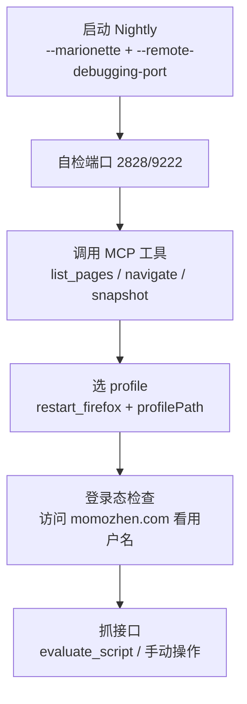

# Firefox Nightly 浏览器调试文档

> 用途：记录用 Firefox Nightly + firefox-devtools-mcp 调试咕咕镇/论坛接口的完整流程与注意事项。
> 最后更新：2026-08-14

---

## 0. 核心规则（必读）

1. **调试脚本默认用 Firefox Nightly，不要用标准版 Firefox。**
   - 标准版（`C:\Program Files\Mozilla Firefox\`）是用户日常浏览器，勿动、勿杀、勿占端口。
   - 所有调试/自动化验证一律启动 Nightly（`C:\Program Files\Firefox Nightly\firefox.exe`）。
2. **MCP 配置文件位置**：工作区级 `.vscode/mcp.json`，即
   `c:\Users\HJM\Documents\Scarletmoon-helper\.vscode\mcp.json`（入库同步，.gitignore 中 `.vscode/*` 的例外项）。
3. MCP 是 `--connect-existing` 模式：**必须先手动启动 Nightly（带 --marionette），MCP 工具才可用**，否则报 `unknown error`（见 §4.2）。

---

## 1. 环境概览

| 项目 | 值 |
|---|---|
| 浏览器 | Firefox Nightly（`C:\Program Files\Firefox Nightly\firefox.exe`） |
| 标准版 Firefox | `C:\Program Files\Mozilla Firefox\firefox.exe`（**勿误杀**） |
| geckodriver | `%LOCALAPPDATA%\Programs\geckodriver\geckodriver.exe` |
| MCP 服务器 | `@mozilla/firefox-devtools-mcp@latest`（经 npx 运行） |
| MCP 配置位置 | `.vscode/mcp.json`（工作区级） |
| 调试端口 | **2828**（Marionette）+ **9222**（BiDi/remote-debugging） |
| 登录 cookie 位置 | `%APPDATA%\Mozilla\Firefox\Profiles\30hfbhjk.default-nightly\cookies.sqlite` |

### Profile 一览（%APPDATA%\Mozilla\Firefox\Profiles\）

| Profile 名 | 目录 | cookies 大小 | 归属 |
|---|---|---|---|
| `default-nightly` | `30hfbhjk.default-nightly` | 524KB ✅ | Nightly 专用（含咕咕镇登录态） |
| `default-release` | `4cx9grih.default-release` | 1MB | 标准版 Firefox |
| `default` | `dt82209w.default` | 0 | 空 profile |

> ⚠️ **Firefox 数据分两地存储**：cookies.sqlite 等会话数据在 **Roaming**（`%APPDATA%`），
> 而 cache 等在 **Local**（`%LOCALAPPDATA%`）。改 profile 时两处同名目录要一起考虑。

---

## 2. MCP 配置（.vscode/mcp.json）

```json
{
  "servers": {
    "firefox-nightly": {
      "type": "stdio",
      "command": "npx.cmd",
      "args": [
        "-y",
        "@mozilla/firefox-devtools-mcp@latest",
        "--connect-existing",
        "--marionette-port",
        "2828",
        "--tool-preset",
        "developer"
      ],
      "env": {
        "START_URL": "https://bbs.kfpromax.com/kf_growup.php",
        "PATH": "%USERPROFILE%\.local\bin;...;%LOCALAPPDATA%\Programs\geckodriver;..."
      }
    }
  }
}
```

**关键参数**：
- `--connect-existing`：连接**已运行**的 Firefox 实例（所以必须先手动启动 Nightly，否则 MCP 工具报 `unknown error`）
- `--marionette-port 2828`：指定 Marionette 端口
- `env.PATH`：必须包含 geckodriver 所在目录，否则找不到驱动

---

## 3. 启动 Firefox Nightly（重要！）

### 3.1 正确启动命令

```powershell
Start-Process "C:\Program Files\Firefox Nightly\firefox.exe" -ArgumentList @("--marionette", "--remote-debugging-port", "9222")
```

**两个标志缺一不可**：
- `--marionette` → 启用 Marionette 协议（MCP 需要）
- `--remote-debugging-port 9222` → 启用 BiDi WebSocket 端点

> 如果只加 `--marionette` 不加 `--remote-debugging-port`，MCP 会报：
> `session has no WebDriver BiDi endpoint (missing webSocketUrl capability)`
> 解决：两个都加后重启。

### 3.2 启动后自检

```powershell
# 检查端口监听（两个都应有输出）
Get-NetTCPConnection -LocalPort 2828 -ErrorAction SilentlyContinue | Select LocalPort,State,OwningProcess
Get-NetTCPConnection -LocalPort 9222 -ErrorAction SilentlyContinue | Select LocalPort,State,OwningProcess
```

确认 2828/9222 都 Listen 后，MCP 工具即可用。

---

## 4. ⚠️ 注意事项（血泪教训）

### 4.1 千万别用 `Get-Process -Name firefox` 杀进程！

`-Name firefox` 会匹配**所有**以 firefox 开头的进程（标准版 + Nightly 全家桶）。
曾因此误杀用户标准版 Firefox。

**正确做法**：按完整路径过滤，只杀 Nightly：

```powershell
Get-Process | Where-Object { $_.Path -like '*Firefox Nightly*' } | Stop-Process -Force
```

**或者**（标准版单独处理）：
```powershell
Get-Process | Where-Object { $_.Path -like '*Mozilla Firefox*' } | Stop-Process -Force
```

### 4.2 MCP 工具报 `unknown error` 的原因

绝大多数情况是 **Firefox Nightly 没在运行**。
MCP 是 `--connect-existing` 模式，连不上已运行实例就会报错。

排查顺序：
1. 先启动 Nightly（见 3.1）
2. 确认 2828/9222 端口在监听
3. 再调用 MCP 工具

### 4.3 用哪个 profile 启动

#### 方式一：弹窗口让用户选择 profile（推荐）⭐

用 `-P`（Profile Manager）参数启动，会**弹出"选择用户配置文件"窗口**，列出所有 profile 让用户手动点选：

```powershell
Start-Process "C:\Program Files\Firefox Nightly\firefox.exe" `
  -ArgumentList @("--marionette", "--remote-debugging-port", "9222", "-P")
```

- 窗口列表来自 `%APPDATA%\Mozilla\Firefox\profiles.ini`（见第 1 节表）
- 选中哪个，就用哪个 profile 的 cookie/登录态启动
- 等价写法：`-ProfileManager`、`--profile-manager`
- 也可以 `-P <ProfileName>`（如 `-P default-nightly`）**跳过窗口直接用指定名字**的 profile 启动

> ⚠️ 注意：`-P` 弹窗时带 `--marionette`/`--remote-debugging-port` 参数**可能不生效**——因为窗口本身是另一个进程。稳妥做法：先弹出选择窗口选好 profile，确认启动后，如果端口没起来，再重新带参数启动一次。

#### 方式二：命令行直接指定 profile 目录（无窗口）
```powershell
Start-Process "C:\Program Files\Firefox Nightly\firefox.exe" `
  -ArgumentList @("--marionette", "--remote-debugging-port", "9222", "-profile", "$env:APPDATA\Mozilla\Firefox\Profiles\30hfbhjk.default-nightly")
```

#### 方式三：MCP 工具 `restart_firefox`（无窗口）
MCP 内置工具 `mcp__mozilla_fire_restart_firefox` 支持指定 profile：

| 参数 | 说明 | 示例 |
|---|---|---|
| `profilePath` | 要使用的 profile 目录 | `%APPDATA%\Mozilla\Firefox\Profiles\30hfbhjk.default-nightly` |
| `firefoxPath` | 浏览器二进制路径 | `C:\Program Files\Firefox Nightly\firefox.exe` |
| `startUrl` | 重启后打开的 URL | `https://www.momozhen.com/` |
| `headless` | 无头模式 | `false` |

> ⚠️ `restart_firefox` 会**关闭所有当前标签页**再重启，用前确认没有未保存状态。

**不带参数调用** = 保持当前 binary/profile 配置重启（等价于刷干净重来）。

### 4.4 标准版与 Nightly 是不同 profile

- 标准版用 `default-release`，Nightly 用 `default-nightly`，**互不干扰**
- 咕咕镇/论坛登录态存在 **Nightly 的 `default-nightly` profile**（cookies.sqlite 524KB）
- 想在标准版看同一登录态 → 得手动登录一遍

### 4.5 PATH 环境变量

`mcp.json` 里 `env.PATH` 已固定写好，含 geckodriver 目录。
如果换了 geckodriver 位置，要同步改这里，否则 MCP 找不到驱动。

---

## 5. 常用调试流程（咕咕镇）



1. **启动**：`Start-Process "C:\Program Files\Firefox Nightly\firefox.exe" -ArgumentList @("--marionette","--remote-debugging-port","9222")`
2. **选 profile**（弹窗口）：加 `-P` 参数启动 → 弹出"选择用户配置文件"窗口 → 手动点选 `default-nightly`（含咕咕镇登录态）
3. **确认登录态**：`mcp__mozilla_fire_list_pages` → 打开 `https://www.momozhen.com/`，页面应显示用户名 `<用户名>`
4. **抓接口**：用 `evaluate_script` 发 fetch 请求，或手动点按钮 + 看网络面板

---

## 6. 端口占用排障

```powershell
# 谁占用了 2828？
Get-NetTCPConnection -LocalPort 2828 | Select LocalAddress,LocalPort,State,OwningProcess
# 看进程详情
Get-Process -Id <OwningProcess> | Select ProcessName,Path
```

- 2828 被占用且不是 Nightly → 可能是残留的 MCP npx 进程，杀掉后重试
- 2828/9222 都没有 → Nightly 没启动（见 4.2）
